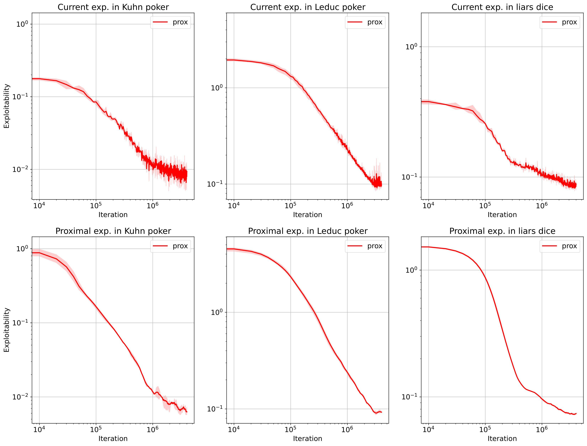

# Proximal algorithm for self-play in IIGs

A minimal deep RL adaptation of proximal point algorithm [1,2] to solve extensive-form imperfect information games (IIGs) by self-play relying solely on sampled game trajectories.

## Content

We propose the $\texttt{Prox}$ agent, an on-policy policy-gradient algorithm inspired from the proximal point method to learn a Nash equilibrium in a two-player zero-sum extensive-form IIGs trough self-play. At a high level $\texttt{Prox}$ combines the regularization scheme proposed by [3] with the generalized advantage estimation method [4]. 

The $\texttt{Prox}$ agent is implemented in [JAX](https://github.com/google/jax) [5] and tested on the following benchmark games, also implemented in JAX closely reproducing the implementation provided by the [OpenSpiel](https://openspiel.readthedocs.io/en/latest/intro.html) library [6]:
 - Kuhn poker, 
 - Leduc poker,
 - Liar's dice. 

Refer to the attached [notes](./notes/notes.pdf) for details.

<center>

</center>


## Usage
To train $\texttt{Prox}$ algorithm on Leduc poker
```bash
   python train_prox.py --config ./configs/leduc_prox.yaml
```

To run experiment 
```bash
    python run_exp.py --config ./experiments/configs/exps/exploitability.yaml
```

To plot experiment
```bash
    python plot_exp.py --config ./experiments/configs/exps/exploitability.yaml
```

## References 

[1] Martinet, B. (1970). Brève communication: régularisation d’inéquations variationnelles par approximations successives. Revue française d’informatique et de recherche opérationnelle. Série rouge, 4(R3), 154–158.

[2] Nemirovski, A. (2004). Prox-Method with Rate of Convergence O(1/t) for Variational Inequalities with Lipschitz Continuous Monotone Operators and Smooth Convex-Concave Saddle Point Problems. SIAM Journal on Optimization, 15(1), 229-251.

[3] Perolat, J., De Vylder, B., Hennes, D., Tarassov, E., Strub, F., de Boer, V., ... Tuyls, K. (2022). Mastering the game 
of Stratego with model-free multiagent reinforcement learning. Science, 378(6623), 990-996. https://www.science.org/doi/abs/10.1126/science.add4679

[4] John Schulman, Philipp Moritz, Sergey Levine, Michael I. Jordan, Pieter Abbeel. (2016). High-Dimensional Continuous Control Using Generalized Advantage Estimation. In Yoshua Bengio and Yann LeCun (Eds.), 4th International Conference on Learning Representations, ICLR 2016, San Juan, Puerto Rico, May 2-4, 2016, Conference Track Proceedings. Retrieved from http://arxiv.org/abs/1506.02438.

[5] James Bradbury, Roy Frostig, Peter Hawkins, Matthew James Johnson, Chris Leary, Dougal Maclaurin, George Necula, Adam Paszke, Jake Vander{P}las, Skye Wanderman-{M}ilne, Qiao Zhang. (2018). JAX: composable transformations of Python+NumPy programs. http://github.com/google/jax, version 0.3.13.

[6] Marc Lanctot, Edward Lockhart, Jean-Baptiste Lespiau, Vinicius Zambaldi, Satyaki Upadhyay, Julien Pérolat, Sriram Srinivasan, Finbarr Timbers, Karl Tuyls, Shayegan Omidshafiei, Daniel Hennes, Dustin Morrill, Paul Muller, Timo Ewalds, Ryan Faulkner, János Kramár, Bart De Vylder, Brennan Saeta, James Bradbury, David Ding, Sebastian Borgeaud, Matthew Lai, Julian Schrittwieser, Thomas Anthony, Edward Hughes, Ivo Danihelka, Jonah Ryan-Davis. (2019). OpenSpiel: A Framework for Reinforcement Learning in Games. CoRR, abs/1908.09453. Retrieved from http://arxiv.org/abs/1908.09453.

[7]Koyamada, S., Okano, S., Nishimori, S., Murata, Y., Habara, K., Kita, H., & Ishii, S. (2023). Pgx: Hardware-Accelerated Parallel Game Simulators for Reinforcement Learning. In Advances in Neural Information Processing Systems.

## Credits

The agent implementation draws significant inspiration from the $\texttt{R-Nad}$ [implementation](https://github.com/google-deepmind/open_spiel/tree/master/open_spiel/python/algorithms/rnad) in the OpenSpiel library. The game implementations blend codes from both OpenSpiel and the general structure found in the [Pgx](https://github.com/sotetsuk/pgx) library [7].